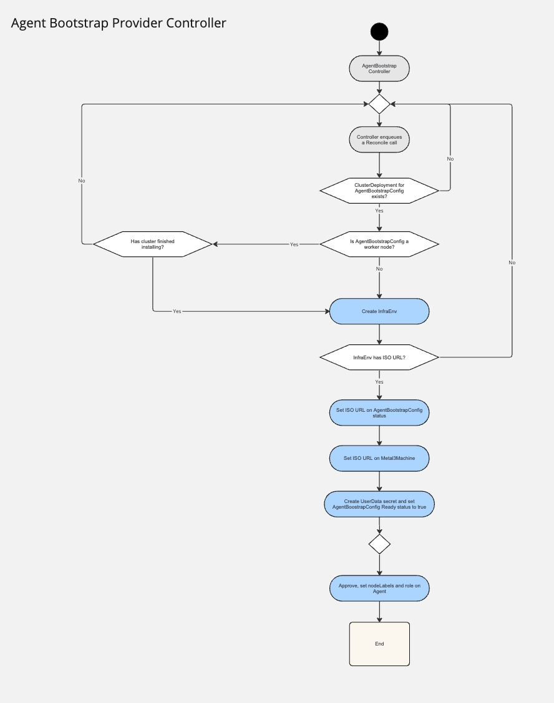
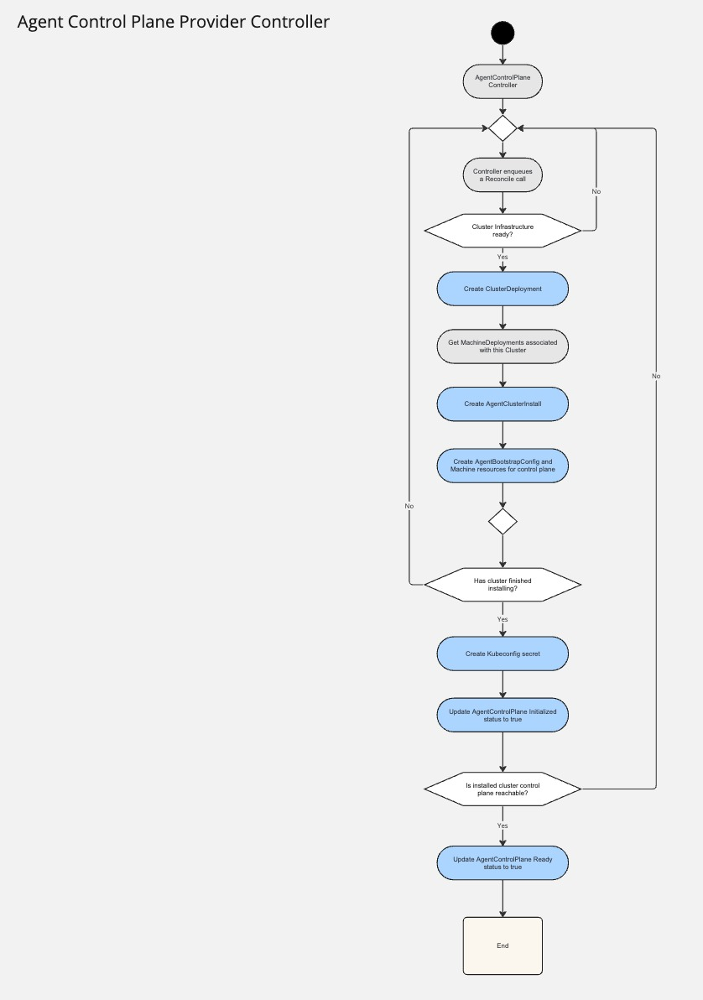

## Cluster API OpenShift Agent providers Architecture Design

## Overview

OpenShift Agent providers are a pair of CAPI providers, bootstrap and control plane, which objective
is to install OpenShift on BareMetal.

### Goals
* Install OpenShift on BareMetal without the need of a Bootstrap Node
* Adheres to cluster API contracts (whenever possible)

### Non-goals
* Install OpenShift on cloud provider platforms

## Supported infrastracture providers
* [CAPM3](https://github.com/metal3-io/cluster-api-provider-metal3)

## Components

### Agent Bootstrap Provider

#### Description

The Agent Bootstrap (AB) provider controller is responsible for generating a live ISO for each machine, interacting 
with assisted installer to install nodes.

#### Custom Resources

TODO: if possible, generate from openapi CRDs below
* [AgentBootstrapConfig](./crd/agent_bootstrap_config.md)
* [AgentBootstrapConfigTemplate](./crd/agent_bootstrap_config_template.md)

#### Flow

AB watches [AgentBootstrapConfig](./crd/agent_bootstrap_config.md), Machines, InfraEnvs and Agents resources 

* creates an InfraEnv resource for each AgentBootstrapConfig and passes the LiveISOURL to the Machine's InfrastructureReference (Metal3Machine)
  * 1 infraenv each metal3machinetemplate
* add iso to template (we need to make sure machine don't escape)
* create BootstrapData secret (empty), to allow machine to boot
* sets Agent's role
* set node providerID label
* approves Agents
* notifies core CAPI components that the machine is ready (setting status.Ready)

### Agent Control Plane Provider

#### Description

The Agent Control Plane (ACP) provider is responsible for orchestrating the cluster installation through assisted installer and relay the control plane status back to CAPI core components.

#### Custom Resources

TODO: if possible, generate from openapi CRDs below
* [AgentControlPlane](./crd/agent_control_plane.md)

#### Flow

ACP watches [AgentControlPlane](./crd/agent_control_plane.md), ClusterDeployment, AgentClusterInstall 

* creates ClusterDeployment
* creates AgentClusterInstall (ACI) and sets control plane and workers number of replicas, according to what's defined in CAPI core components
* creates Machines and AgentBootstrapConfigs for the control plane
* once ACI installs successfully, it creates a kubeconfig secret and sets status' Initialized and Ready for CAPI core components to read 

### Notes

* The first installation will be performed as day-1 (master+workers at the same time)
* All nodes added after the first installation, they will be added as day-2 nodes
* AB controller will prevent Machines from installing when an installation is in progress. Once the installation completes, they will be added 

### Future work

* Leverage use qcow2 instead of live-iso from assisted

Remove this:
TODO: global flow/diagram section?